# Set Finder App - Screen Recording Demo
A white bounding box indicates a Set playing card has been detected. The small colored squares within the bounding boxes illustrate which card can be combined to form a set.

  
    

 

# Acknowledgement

The card detection and classification was done with Ultralytic's implementation of YOLO5: 
https://github.com/ultralytics/yolov5   
The android app was based on Pytorch's object detection demo app. I've made a lot of changes to their code in order to make it fit my own needs, but there's still a significant overlap.  
https://github.com/pytorch/android-demo-app/tree/master/ObjectDetection.   I was initially inspired by the youtuber geaxgx1 during the research phase of the project, especially his video on card detection has been helpful:  https://www.youtube.com/watch?v=pnntrewH0xg

 

# Motivation
The primary motivation of the project was to gain a better understanding of the whole machine learning pipeline i.e. from initial idea to a production ready application.

I've learned a lot about ML from projects that I've completed during my time at university. With that said, I often felt that these projects were somewhat artificial in nature, because many of the challenges had been solved for us students beforehand. Especially 2 areas felt neglected:

    1.) Creation of datasets / data preprocessing
    2.) Getting models ready for production

I felt like the best way to get some experience within these 2 areas was to make a non-trivial project were these 2 areas were the main focus.  
Area 1.) was easy, just make a dataset from scratch and experience some of the challenges associated with this.  
Area 2.) was a bit harder to crack, due to my lack of expertise in the area. I decided to do a mobile app, because I felt like the limited hardware available here could be most educational.

 

# Project overview
The main goal of the project is to develop an android app that can automatically detect so-called sets in the popular card game Set. I've described the rules of the game at the bottom of this page, but it's not important to understand the project. All you need to know is that the game is all about finding sets of 3 cards from a pole of 12-15 different cards.  
An overview of the project and its challenges is shown below followed by an in depth explanations of each of the 3 subproblems 1.) 2.) and 3.).

  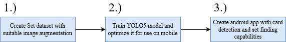

 

## 1.) Creating the dataset

### Video processing
Creating the dataset was centered around keeping the amount of manual work to a minimum, whilst still obtaining at least a 100 different images for each of the 81 set cards. I ended up achieving this by automatically extracting images from videos I recorded from various angles and under different lighting conditions. `preprocess_video.py` was used to extract and process each individual frame and `combine_video_frame_folder.py` was used to combine folders from different processed videos.
  
Visualization of the extraction process:

<table><tr>
<td>
     </td>
<td>
     </td>
</tr></table>

<table><tr>
<td>
     </td>
<td>
    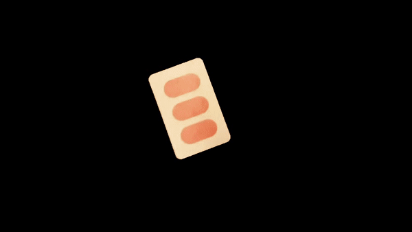 </td>
</tr></table>

### Image augmentation - pretraining
Image augmentations which would be to hard / time consuming to do during training was baked into to the dataset directly. This was done with `do_augmentation.py` which expects a folder structure similar to that provided  by `preprocess_video.py`. The intended effect of performing pretraining image augmentation is to avoid overfitting and to train a YOLO-model which will generalize well, while keeping training time at reasonable level. From pilot runs, I gathered that the most important pretraining augmentations were:

* Background swapping.
* Card/background resize
* Card rotation and shear
<!--  Remove bullet point formatting-->

Examples of pre-training image augmentations:

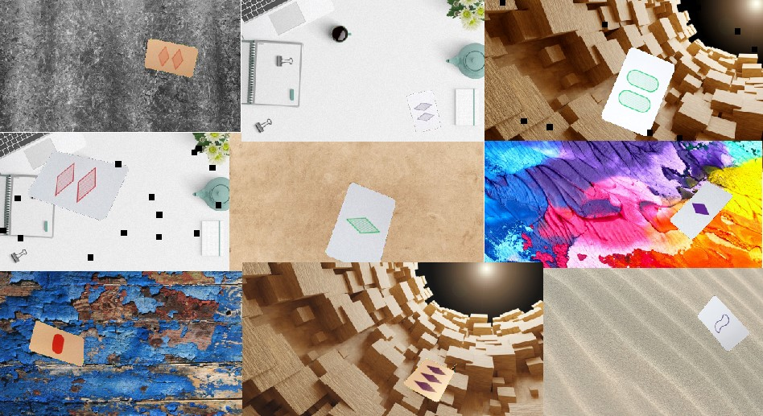

### Dataset and Annotations

Each augmented image in the dataset is stored together with bounding box coordinates (in YOLO-format) and a corresponding label.
 

  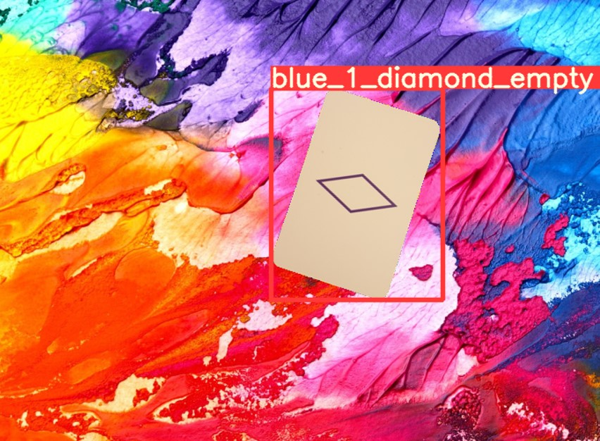

I have included a small dataset under `./toy_dataset`. This dataset contains a single image per card type and have a smaller image size than the original, but is otherwise identical. The final dataset contained 200 images per card type and was 2x the size. 

 

## 2.) YOLO5
Ultralytic (the creators of the YOLO implementation used in the project) has made it relatively straight forward to train their YOLO-model on a custom dataset, as long as their format requirements are met (.yaml setup file, specific folder structure etc.).   More specifically, Ultralytic has made a `train.py` which work sort of like a command line API. I changed some hyperparameters and fiddled a bit with the default training augmentations ( e.g. removed hue/brightness change because it was to overwhelming). But other than that I simply used their `train.py` to finetune their smallest pretrained YOLO-model: `yolov5s`. I trained a lot of models with different hyperparameters, augmentation etc. until I found one which I was satisfied with.
  
Training example from Ultrasonic's jupyter notebook tutorial:
 (https://github.com/ultralytics/yolov5/blob/master/tutorial.ipynb)

  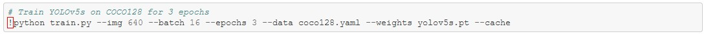

### Training with Weights and Biases
Weights and Biases (https://wandb.ai) was an integrated part of the training phase which made it super easy to monitor the model's performance. I've included some of the key figures here
  
<u>Train loss:</u>
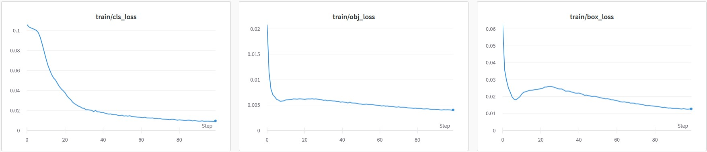
 
<u>Validation loss:</u>
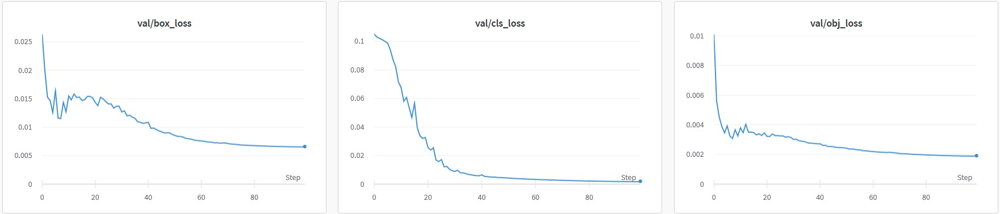
 
<u>Validation metrics:</u>
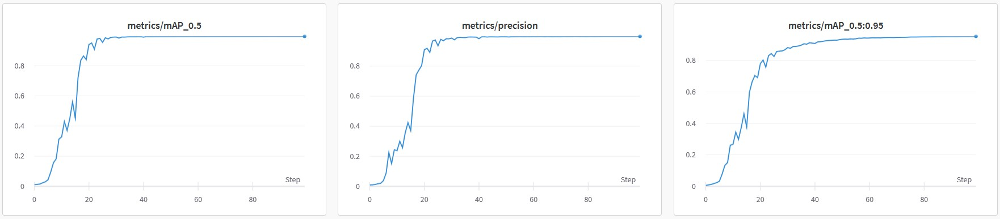

### Predictions by the final model
The model ended up pretty successful, there's definitely room for improvement, but its quite robust and works well most of the time. There's a couple of examples below. Notice that model confused blue with red in the image to the right (row 3, column 2). I have included that mistake, because it's the most common one the model makes (i.e. empty red gets confused with blue under artificial light sources).
<table><tr>
<td>
    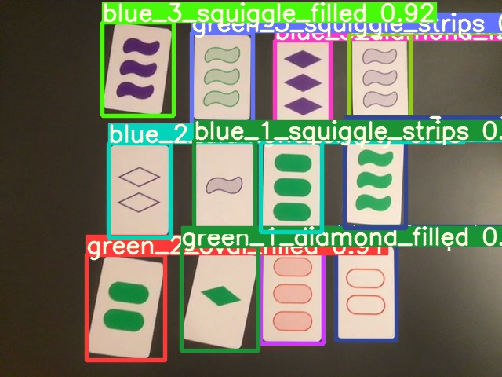 </td>
<td>
    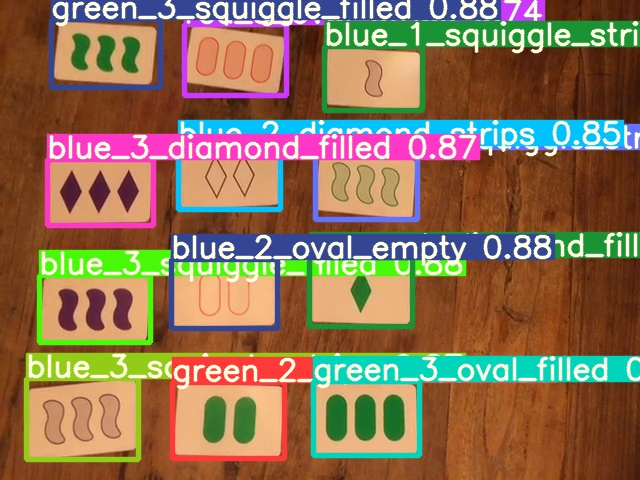 </td>
</tr></table>

### Optimization - Getting it to run on mobile
It's one thing to make YOLO run on a fairly beefy computer, but another entirely to make it run on mobile hardware. I tried a lot of optimization stuff, but after a lot of testing, the only thing that seemed to do a significant difference was to export the model to Pytorch's TorchScript. In the end i got around 3 frames a second on a Samsung Galaxy 8. The final model is located at `./android_app/app/src/main/assets/yolov5s.torchscript.pt`

 

## 3.) Set finder - Android app

Both the app's design and functionality is very simplistic. The app is ready to go as soon as it's opened i.e. cards are being detected and potential sets are being highlighted: 

  

 
A white bounding box indicates a Set playing card has been detected. The small colored squares within the bounding boxes illustrates which cards can be combined to form a set. A single card can potentially be used to form more than 1 set, hence the multiple squares at some cards.
  
There's also a menu, which provide a bit more functionality. This is however primarily for debugging purposes. There's 3 things in the menu: 

* 1.) Test-button: run set detection on 3 images which is shipped together with the app.
* 2.) Photo-button: Run set detection on a photo taken by the user as opposed to live video.
* 3.) Live-button: This is where the app opens and how it's intended to be used.

<!--  Remove bullet point formatting-->
App menu illustrations:

  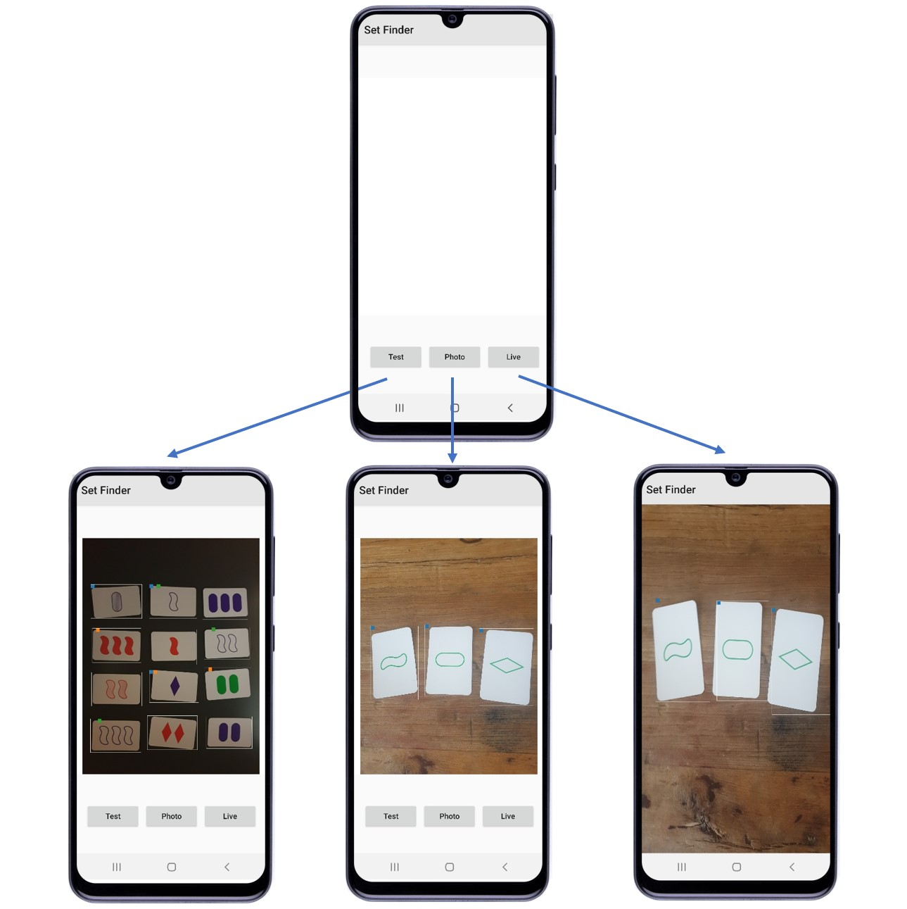

 

# Set - Rules of the card game

There is a total of 81 different cards in the game. Each card is a combination of 4 categories each of which can take on 3 different values. The 4 categories and their respective values are:
* Shape: Diamond, squiggle, oval 
* Count: 1, 2, 3
* Color: Red, green, purple
* Shading: Filled, strips, empty

The rules of Set is pretty straight forward. The goal of the game is to find 3 cards (a so-called set, hence the name of the game) which obey the following rule: For each of the 4 categories in a set of 3 cards, each card must be the same as the two other cards, or all 3 must have different values. During the game there's normally a total of 12 cards, but 3 extra cards can be added if no sets can be found.

Official game rules: 
https://www.setgame.com/sites/default/files/instructions/SET%20INSTRUCTIONS%20-%20ENGLISH.pdf
